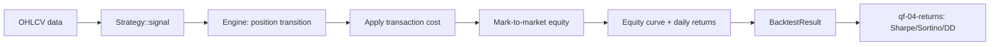

# qf-05-backtest — Backtesting Basics

Phase 5 of the quant-finance curriculum: a minimal, correct backtest engine
for long-only trading strategies on OHLCV data.

## What it does

- Generates trading signals from price history via the `Strategy` trait
- Manages position transitions (long / flat) with transaction costs on every
  entry and exit
- Produces an equity curve, per-bar returns, and a round-trip trade log
- Reports risk-adjusted metrics by delegating to `qf-04-returns` (Sharpe,
  Sortino, max drawdown, annualised volatility)

## Quick start

```bash
cargo test -p qf-05-backtest
cargo clippy -p qf-05-backtest --all-targets -- -D warnings
cargo run -p qf-05-backtest --example backtest_demo
```

## Example

```rust
use qf_03_stocks::Ohlcv;
use qf_05_backtest::{run_backtest, BacktestConfig, BuyAndHold, SmaCrossover};

let data: Vec<Ohlcv> = /* OHLCV bars, oldest first */ Vec::new();
let config = BacktestConfig::default();

// Active strategy
let sma = SmaCrossover::new(10, 30).unwrap();
let active = run_backtest(&sma, &data, &config).unwrap();

// Passive benchmark
let bh = run_backtest(&BuyAndHold, &data, &config).unwrap();

println!("Sharpe:  {:.2}", active.sharpe(0.0));
println!("Max DD:  {:.2}%", active.max_drawdown() * 100.0);
println!("Alpha:  {:+.2}%", (active.total_return - bh.total_return) * 100.0);
```

## Architecture



The `Strategy` trait is the extension point. Implement it to plug in any
signal generator (indicator crossover, ML model, rule-based logic). The engine
is generic over `S: Strategy` so new strategies require no engine changes.

## Design constraints

- **No look-ahead bias.** `signal(data, index)` only sees `data[..=index]`.
- **Long-only.** `Position::Short` is declared for forward compatibility, but
  `BacktestConfig::allow_short = true` is rejected in Phase 5.
- **Hand-rolled math.** No external statistics crates; metrics delegate to
  `qf-04-returns`.
- **Synthetic data only in tests.** No external files are required to run the
  test suite.

## Module overview

| Module | Responsibility |
|---|---|
| `error` | `BacktestError` |
| `signal` | `Signal`, `Position` |
| `strategy` | `Strategy` trait, `SmaCrossover`, `BuyAndHold` |
| `backtest` | `BacktestConfig`, `Trade`, `BacktestResult`, `run_backtest` |

See `src/README.md` for details.

## Dependencies

- `qf-common`
- `qf-03-stocks`
- `qf-04-returns`
- `thiserror`

## Status

Phase 5 complete. 20 tests passing, clippy clean.