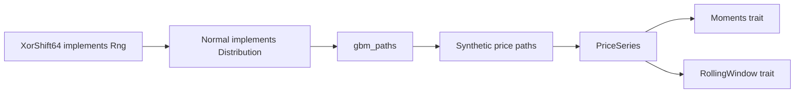

# quant-core — Foundations: Moments and Fat Tails

Phase 6 of the quant-finance curriculum: the advanced-track foundation crate.
Series types, sample moments (including skewness and excess kurtosis), rolling
windows, and a deterministic geometric Brownian motion simulator — all
hand-rolled, no external statistics crates.

## What it does

- `PriceSeries` newtype enforcing strictly positive, finite prices
- Simple and log returns with the identity `log = ln(1 + simple)`
- Moments: `mean`, sample `variance` (n - 1), `std_dev`, `skewness` (g1),
  `excess_kurtosis` (g2)
- Generic `rolling(window, data, f)` and convenience `rolling_mean`,
  `rolling_std_dev`
- `XorShift64` PRNG (Vigna 2014), `Normal` via Box-Muller, exact-solution GBM
- A `fat_tails` example that shows excess kurtosis near 0 for Gaussian draws
  and > 1 when rare large moves are injected

## Quick start

```bash
cargo test -p quant-core
cargo clippy -p quant-core --all-targets -- -D warnings
cargo run -p quant-core --example fat_tails
```

## Example

```rust
use quant_core::{XorShift64, Normal, Distribution, gbm_paths, excess_kurtosis};

let mut rng = XorShift64::new(42);
let normal = Normal::standard();
let draws: Vec<f64> = (0..10_000).map(|_| normal.sample(&mut rng)).collect();
let k = excess_kurtosis(&draws).unwrap();
println!("excess kurtosis = {:.4}", k); // ~0.0 for Gaussian

let paths = gbm_paths(100.0, 0.05, 0.2, 1.0, 252, 1000, &mut rng);
let terminals: Vec<f64> = paths.iter().map(|p| p[252]).collect();
let k = excess_kurtosis(&terminals).unwrap();
println!("GBM terminal kurtosis = {:.4}", k); // positive: log-normal right tail
```

## Architecture



The `Rng` and `Distribution` traits decouple the source of randomness from the
sampler, so `gbm_paths` is generic over any `R: Rng`. New distributions
(exponential, student-t, jump-diffusion) can be added by implementing
`Distribution` without touching the simulator.

## Design constraints

- **Hand-rolled math.** No `rand`, `nalgebra`, `statrs`. The pedagogy is in
  the implementation.
- **No panics.** All fallible functions return `Result<_, CoreError>`. `mean`
  on empty input returns `0.0`.
- **Deterministic.** Same seed → identical stream. `XorShift64::new(0)` is
  replaced with a non-zero default to avoid the degenerate zero stream.
- **Population central moments for skewness/kurtosis.** `variance` is the
  sample (n - 1) estimator; higher moments use the textbook population
  central moments (denominator n). The difference vanishes for large n.

## Module overview

| Module | Responsibility |
|---|---|
| `error` | `CoreError` |
| `series` | `PriceSeries`, `simple_returns`, `log_returns` |
| `moments` | `Moments` trait, `mean`, `variance`, `std_dev`, `skewness`, `excess_kurtosis` |
| `rolling` | `RollingWindow` trait, `rolling`, `rolling_mean`, `rolling_std_dev` |
| `sim` | `Rng`, `XorShift64`, `Distribution`, `Normal`, `gbm_paths` |

See `src/README.md` for details.

## Dependencies

- `thiserror`
- Dev: `approx`

## Status

Phase 6 complete. 16 contract tests + 1 smoke test passing, clippy clean.