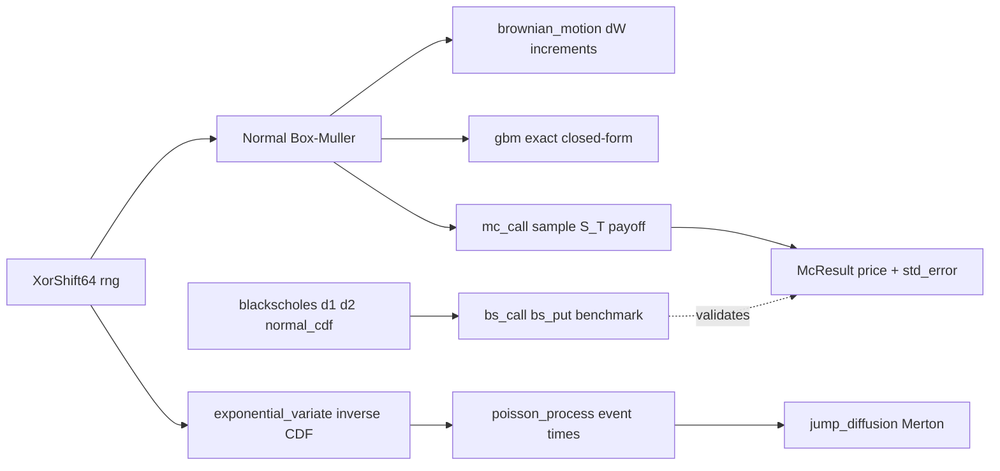

# quant-stochastic — Stochastic Processes and Monte Carlo

Phase 9 of the quant-finance curriculum: hand-rolled stochastic processes and
Monte Carlo pricing. Standard Brownian motion, geometric Brownian motion, the
Poisson process, the Merton jump-diffusion, and Monte Carlo European option
pricing with antithetic variates. A closed-form Black-Scholes module provides
the analytical benchmark for validating the Monte Carlo estimator. No `rand`,
`nalgebra`, or `statrs` — randomness comes from `quant-core`'s `XorShift64`
and `Normal`.

## What it does

- **Brownian motion.** `brownian_motion(n, dt, rng)` simulates a standard BM
  path `W_0 = 0, W_{t+dt} = W_t + sqrt(dt) * Z`. `quadratic_variation` sums
  squared increments (converges to `T = n*dt` as `n -> infinity`).
- **GBM.** `gbm(s0, mu, sigma, t, n, rng)` uses the exact closed-form solution
  `S_{t+dt} = S_t * exp((mu - 0.5*sigma^2)*dt + sigma*sqrt(dt)*Z)`. With
  `sigma = 0` the path is deterministic: `S_T = s0 * exp(mu*T)`.
- **Poisson process.** `exponential_variate(rate, rng)` draws `Exp(rate)` via
  inverse-CDF. `poisson_process(rate, t, rng)` returns the event times;
  `poisson_count` returns just the count `N(t) ~ Poisson(rate*t)`.
- **Merton jump-diffusion.** `jump_diffusion(s0, mu, sigma, jump_rate,
  jump_mean, t, n, rng)` evolves GBM and multiplies the price by
  `J = exp(jump_mean)` at each Poisson event time. With `jump_rate = 0` it
  reduces exactly to `gbm`.
- **Black-Scholes (benchmark).** `bs_call`, `bs_put`, `d1`, `d2`,
  `normal_cdf` (Abramowitz-Stegun erf, max error `< 7.5e-8`). The analytical
  reference for validating Monte Carlo.
- **Monte Carlo.** `mc_call`, `mc_put` sample `S_T = S0 * exp((r - 0.5*sigma^2)*T
  + sigma*sqrt(T)*Z)` and discount `exp(-rT) * mean(payoff)`. Returns `McResult
  { price, std_error, n_paths }`. `mc_call_antithetic` uses `Z` and `-Z` pairs
  for variance reduction. `ci_half_width` gives confidence-interval widths.

## Quick start

```bash
cargo test -p quant-stochastic
cargo clippy -p quant-stochastic --all-targets -- -D warnings
cargo run -p quant-stochastic --example mc_pricing
cargo run -p quant-stochastic --example brownian_paths
```

## Example

```rust
use quant_core::XorShift64;
use quant_stochastic::{bs_call, mc_call};

let mut rng = XorShift64::new(42);

// Monte Carlo European call under risk-neutral GBM.
let mc = mc_call(100.0, 100.0, 0.05, 0.2, 1.0, 100_000, &mut rng).unwrap();

// Black-Scholes analytical benchmark.
let bs = bs_call(100.0, 100.0, 0.05, 0.2, 1.0);

// MC converges to BS as N -> infinity.
assert!((mc.price - bs).abs() < 3.0 * mc.std_error);

// Standard error shrinks as 1/sqrt(N).
let mc_small = mc_call(100.0, 100.0, 0.05, 0.2, 1.0, 10_000, &mut rng).unwrap();
assert!(mc.std_error < mc_small.std_error / 3.0);
```

## Architecture



The Monte Carlo estimator samples the GBM terminal distribution directly
(`S_T` is log-normal), so each path is a single normal draw — no time-stepping
is needed for European options. The Black-Scholes module provides the
analytical price that the MC estimator converges to.

## Design constraints

- **Hand-rolled math.** No `rand`, `nalgebra`, `statrs`, or `optimization`.
  Randomness comes from `quant-core`'s `XorShift64` (xorshift64*) and `Normal`
  (Box-Muller). The normal CDF uses the Abramowitz-Stegun (1964) formula 7.1.26
  erf approximation (max error `< 7.5e-8`).
- **Exact GBM solution.** GBM uses the closed-form `S_t = S0 * exp(...)` not
  Euler discretisation, so the terminal distribution is exact for any `dt`.
  Monte Carlo pricing uses a single normal draw per path (the terminal `Z`),
  which is the minimal-variance estimator.
- **No panics in library paths.** All fallible functions return
  `Result<_, StochError>`. Non-positive prices/strikes, negative volatilities,
  zero time, and zero paths are reported as typed errors.
- **Antithetic variates.** `mc_call_antithetic` pairs `Z` and `-Z` draws. For
  monotone payoffs (options), the pair average has lower variance than two
  independent samples, giving a smaller standard error per normal draw.
- **Standard error.** `McResult::std_error` is `exp(-rT) * std(payoffs) /
  sqrt(N)` with the sample standard deviation (n-1 denominator). SE scales as
  `1/sqrt(N)` — quadrupling paths halves the SE.

## Module overview

| Module | Responsibility |
|---|---|
| `error` | `StochError` (InvalidParam, InsufficientData, ConvergenceFailure) |
| `brownian` | `brownian_motion`, `gbm`, `quadratic_variation` |
| `poisson` | `exponential_variate`, `poisson_process`, `poisson_count`, `jump_diffusion` |
| `blackscholes` | `bs_call`, `bs_put`, `d1`, `d2`, `normal_cdf` (analytical benchmark) |
| `montecarlo` | `mc_call`, `mc_put`, `mc_call_antithetic`, `McResult`, `ci_half_width` |

See `src/README.md` for design principles and module details.

## Dependencies

- `quant-core` — `XorShift64`, `Normal`, `Distribution`, `Rng`
- `thiserror` (derive error types)
- Dev: `approx` (float comparisons), `quant-core`

## Status

Phase 9 complete. 16 tests + 1 doc test passing, clippy clean. MC call
converges to Black-Scholes (10.42 vs 10.45 at N=100k); SE scales as
`1/sqrt(N)` (4x paths -> 2.02x smaller SE); antithetic variates reduce SE by
28.8%; put-call parity holds within combined standard error.