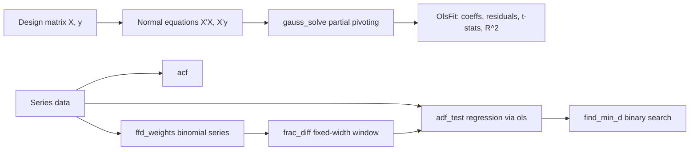

# quant-timeseries — Stationarity and Fractional Differentiation

Phase 7 of the quant-finance curriculum: hand-rolled time-series econometrics.
Ordinary least squares via Gaussian elimination with partial pivoting, the
autocorrelation function, the Augmented Dickey-Fuller test for unit roots, and
López de Prado's fixed-width fractional differentiation from *Advances in
Financial Machine Learning* (Ch.5).

## What it does

- **OLS regression.** Solve `y = X β + ε` via the normal equations and Gaussian
  elimination with partial pivoting. Returns coefficients, residuals, standard
  errors, t-statistics, and R². Detects collinearity as `TimeSeriesError::Singular`.
- **Autocorrelation function.** Sample ACF for lags `0..=max_lag` with
  `acf(0) = 1` by construction. Diagnoses serial dependence structure.
- **ADF test.** Tests `H_0: unit root (non-stationary)` against `H_1: stationary`
  with the MacKinnon (1996) 5% critical value `-2.86`. Reject when the
  t-statistic on the lagged-level coefficient is below the critical value.
- **Fractional differentiation.** Fixed-width FFD weights via the binomial
  series `(1 - B)^d`. `frac_diff` applies the window; `find_min_d` performs a
  binary search over `d ∈ [0, 1]` to find the smallest order that passes the
  ADF test — the sweet spot that makes the series stationary while preserving
  as much memory as possible.

## Quick start

```bash
cargo test -p quant-timeseries
cargo clippy -p quant-timeseries --all-targets -- -D warnings
cargo run -p quant-timeseries --example stationarity
cargo run -p quant-timeseries --example ffd_demo
```

## Example

```rust
use quant_core::{Distribution, Normal, XorShift64};
use quant_timeseries::{adf_test, frac_diff, find_min_d};

let mut rng = XorShift64::new(42);
let normal = Normal::standard();
let mut s = 100.0_f64;
let mut prices = vec![s];
for _ in 0..500 {
    s += normal.sample(&mut rng);
    prices.push(s);
}

// The random walk is non-stationary.
let r = adf_test(&prices, 1).unwrap();
assert!(!r.is_stationary);

// Find the minimum d that achieves stationarity.
let d = find_min_d(&prices, 1e-4, 0.01).unwrap();
println!("min d = {:.2}", d); // typically 0.2..0.5

let diff = frac_diff(&prices, d, 1e-4).unwrap();
let r = adf_test(&diff, 1).unwrap();
assert!(r.is_stationary);
```

## Architecture



OLS is the workhorse: `adf_test` builds its regression rows and delegates to
`ols`, and `find_min_d` repeatedly calls `adf_test` inside a binary search.

## Design constraints

- **Hand-rolled math.** No `nalgebra`, no `statrs`, no `ndarray`. OLS solves
  the normal equations directly; the diagonal of `(X'X)^{-1}` is recovered by
  re-solving `X'X e_j = unit_j` for each column — fine for the small `k` (2..5)
  we encounter here.
- **No panics in library paths.** All fallible functions return
  `Result<_, TimeSeriesError>`. Dimension mismatches, collinearity, too-short
  series, and invalid parameters are all reported as typed errors.
- **Fixed-width FFD.** Weights accumulate until `|w_k| < threshold`, at which
  point the loop breaks *before* pushing the offending weight. This gives
  `[1.0]` for `d = 0` and `[1.0, -1.0]` for `d = 1` exactly, matching the
  binomial interpretation.
- **MacKinnon critical value.** Hardcoded `-2.86` for the constant-no-trend
  specification at 5% significance, per MacKinnon (1996).

## Module overview

| Module | Responsibility |
|---|---|
| `error` | `TimeSeriesError` |
| `ols` | `OlsFit`, `ols`, `gauss_solve` (pub crate) |
| `acf` | `acf` |
| `adf` | `AdfResult`, `adf_test`, `MACKINNON_5PCT` |
| `fracdiff` | `ffd_weights`, `frac_diff`, `find_min_d` |

See `src/README.md` for details.

## Dependencies

- `quant-core` — RNG, `Normal`, GBM (used by tests and examples)
- `thiserror`
- Dev: `approx`, `quant-core`

## Status

Phase 7 complete. 17 contract tests + 1 extra GBM test passing, clippy clean.