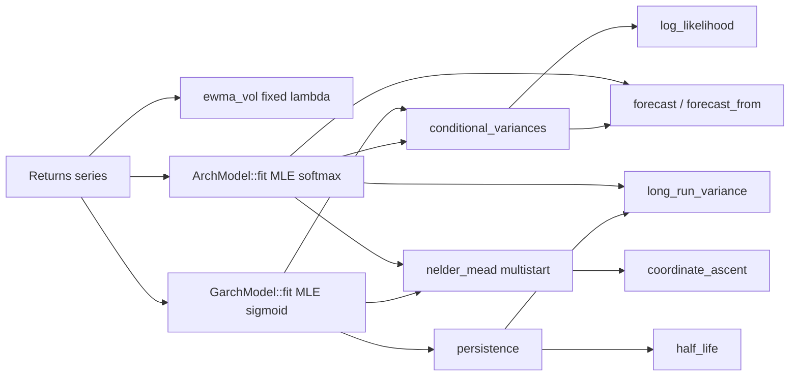

# quant-vol — Volatility Models: EWMA, ARCH, GARCH

Phase 8 of the quant-finance curriculum: hand-rolled volatility models —
exponentially weighted moving average (EWMA/RiskMetrics), ARCH(q) (Engle 1982),
and GARCH(p, q) (Bollerslev 1986). Maximum-likelihood fitting uses a hand-rolled
Nelder-Mead simplex search and a coordinate-ascent multi-start optimiser. No
`argmin`, `optimization`, `nalgebra`, or `statrs`.

## What it does

- **EWMA (RiskMetrics).** `ewma_vol(returns, lambda)` computes the conditional
  variance path `sigma_t^2 = lambda * sigma_{t-1}^2 + (1 - lambda) * r_{t-1}^2`
  with the standard `lambda = 0.94` for daily data. `sigma_0^2 = r_0^2`.
- **ARCH(q).** `ArchModel { omega, alphas }` fits Engle's original
  specification `sigma_t^2 = omega + sum alpha_i * r_{t-i}^2` by Gaussian MLE.
  Provides `conditional_variances`, `log_likelihood`, `forecast`, and
  `long_run_variance`. Fitting uses a softmax parameterisation that guarantees
  `omega > 0`, `alpha_i >= 0`, and `sum(alpha) < 1` (stationarity).
- **GARCH(p, q).** `GarchModel { omega, alphas, betas }` fits Bollerslev's
  `sigma_t^2 = omega + sum alpha_i * r_{t-i}^2 + sum beta_j * sigma_{t-j}^2`
  by Gaussian MLE. Provides `persistence`, `long_run_variance`, `half_life`,
  `forecast`, and `forecast_from`. Fitting uses a sigmoid parameterisation
  with a hard persistence cap at `0.998` to keep the model strictly stationary.
- **Hand-rolled optimisers.** `nelder_mead::maximize` (Nelder-Mead simplex),
  `nelder_mead::coordinate_ascent` (coordinate-wise hill climbing with adaptive
  step halving), and `nelder_mead::multistart` (multi-start with perturbations).
  All maximise the objective directly — no negation.

## Quick start

```bash
cargo test -p quant-vol
cargo clippy -p quant-vol --all-targets -- -D warnings
cargo run -p quant-vol --example vol_demo
cargo run -p quant-vol --example vol_clustering
```

## Example

```rust
use quant_core::{Distribution, Normal, XorShift64};
use quant_vol::{ewma_vol, ArchModel, GarchModel};

let mut rng = XorShift64::new(42);
let normal = Normal::standard();

// Simulate GARCH(1,1) returns.
let (omega, alpha, beta) = (0.01_f64, 0.08, 0.90);
let mut sigma2 = omega / (1.0 - alpha - beta);
let mut returns = Vec::new();
for _ in 0..2000 {
    let z = normal.sample(&mut rng);
    let r = sigma2.sqrt() * z;
    returns.push(r);
    sigma2 = omega + alpha * r * r + beta * sigma2;
}

// EWMA (fixed lambda).
let ewma_sigma2 = ewma_vol(&returns, 0.94).unwrap();

// ARCH(1) via MLE.
let arch = ArchModel::fit(&returns, 1).unwrap();
let arch_ll = arch.log_likelihood(&returns);

// GARCH(1,1) via MLE.
let garch = GarchModel::fit(&returns, 1, 1).unwrap();
let garch_ll = garch.log_likelihood(&returns);
assert!(garch_ll > arch_ll, "GARCH should beat ARCH");
assert!(garch.persistence() < 1.0, "must be stationary");
```

## Architecture



The MLE fitters map an unconstrained parameter vector `t` to the constrained
space (`omega > 0`, non-negative coefficients, `persistence < 1`), evaluate the
Gaussian log-likelihood, and hand the objective to `multistart`, which runs
`coordinate_ascent` from `x0` plus five perturbations and keeps the best result.

## Design constraints

- **Hand-rolled math.** No `argmin`, `optimization`, `nalgebra`, `statrs`, or
  `rand`. The optimiser is a textbook Nelder-Mead plus coordinate-ascent
  multi-start; the RNG and `Normal` sampler come from `quant-core`.
- **Maximise, do not minimise.** All optimisers *maximise* the objective. The
  MLE closures pass `model.log_likelihood(returns)` directly — there is no
  negation. (Negating the LL and feeding it to a maximiser would find the
  *worst* model, a subtle bug that bit an earlier iteration.)
- **Constrained MLE via parameter transformation.** GARCH uses `omega = exp(t0)`,
  `alpha_i = sigmoid(t_i) * 0.49 / q`, and
  `beta_j = sigmoid(t_j) * (0.998 - sum(alpha)) / p`, which guarantees
  positivity, non-negativity, and `persistence < 0.998`. ARCH uses a softmax
  transform. Transformed parameters are clamped to `[-30, 30]` before `exp` /
  `sigmoid` to prevent overflow.
- **Warmup skipping in GARCH LL.** The first `max(p, q)` observations are
  initialised to the sample variance and excluded from the log-likelihood sum
  to avoid contamination from the arbitrary initialisation.
- **Variance clamping.** `conditional_variances` clamps each `sigma_t^2` to
  `[1e-300, 1e15]` to prevent overflow in long recursions.
- **No panics in library paths.** All fallible functions return
  `Result<_, VolError>`. Invalid parameters, too-short series, and
  convergence failures are reported as typed errors.

## Module overview

| Module | Responsibility |
|---|---|
| `error` | `VolError` (InvalidParam, InsufficientData, ConvergenceFailure, NonStationary) |
| `ewma` | `ewma_vol` — EWMA conditional variance path |
| `arch` | `ArchModel` — ARCH(q) with MLE fit, forecast, log-likelihood |
| `garch` | `GarchModel` — GARCH(p,q) with MLE fit, forecast, persistence, half-life |
| `nelder_mead` | `maximize`, `coordinate_ascent`, `multistart` optimisers |

See `src/README.md` for design principles and optimisation notes.

## Dependencies

- `quant-core` — `XorShift64`, `Normal`, `Distribution` (RNG for tests/examples)
- `thiserror` (derive error types)
- Dev: `approx` (float comparisons), `quant-core`

## Status

Phase 8 complete. 17 tests passing (15 contract + 2 error handling), clippy
clean. GARCH(1,1) MLE recovers true persistence within 0.01 on 2000
observations; GARCH beats constant-volatility by 1952 LL points on a
two-regime clustering dataset.