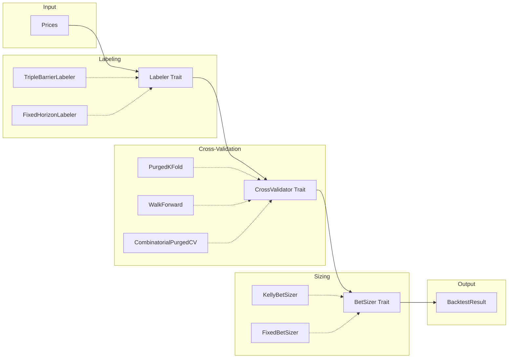

# Phase 14.5: Trait Architecture & Walk-Forward Analysis

## Overview

**Why**: The quant-lab crates have inconsistent trait coverage. Early crates (quant-core, qf-02-loan, qf-03-stocks, qf-04-returns, qf-05-backtest) follow excellent trait-based patterns. Later crates (quant-backtest, quant-options, quant-stochastic, quant-factors, quant-microstructure) use concrete types without traits, breaking composability.

**Business Driver**: quant-lib v1.0 must be a reusable toolkit for video series and real projects (stock-sim, b3-swing-trading). Trait-based architecture enables:
- Swappable implementations (e.g., different CV methods, pricing models)
- User-defined extensions without forking
- Cleaner testing via mock implementations
- Alignment with Rust idioms and embedded-hal patterns

**Scope**: Pre-Phase 15 improvement. All changes are additive (no breaking changes).

---

## Requirements

### R1: Trait Definitions (quant-core extension)

| ID | Requirement |
|----|-------------|
| R1.1 | Add `CrossValidator` trait to quant-core with `splits()` method |
| R1.2 | Add `Labeler` trait to quant-core with `label()` method |
| R1.3 | Add `BetSizer` trait to quant-core with `size()` method |
| R1.4 | Add `SampleWeighter` trait to quant-core with `weights()` method |
| R1.5 | Add `StochasticProcess` trait to quant-core with `simulate()` and `terminal()` |
| R1.6 | Add `OptionPricer` trait to quant-core with `price()` method |
| R1.7 | Add `Greeks` trait to quant-core with `delta()`, `gamma()`, `vega()`, `theta()`, `rho()` |
| R1.8 | Add `FactorModel` trait to quant-core with `fit()`, `exposures()`, `decompose()` |
| R1.9 | Add `ImpactModel` trait to quant-core with `impact()` method |
| R1.10 | Add `OrderBookOps` trait to quant-core with `add_order()`, `cancel_order()`, `market_order()` |

### R2: Trait Implementations (existing crates)

| ID | Requirement |
|----|-------------|
| R2.1 | Implement `CrossValidator` for `PurgedKFold` in quant-backtest |
| R2.2 | Implement `CrossValidator` for new `WalkForward` struct in quant-backtest |
| R2.3 | Implement `Labeler` for `TripleBarrierLabeler` in quant-backtest |
| R2.4 | Implement `BetSizer` for `KellyBetSizer`, `FixedBetSizer`, `EqualBetSizer` |
| R2.5 | Implement `SampleWeighter` for `UniquenessWeighter` in quant-backtest |
| R2.6 | Implement `StochasticProcess` for `Gbm`, `Poisson`, `JumpDiffusion` in quant-stochastic |
| R2.7 | Implement `OptionPricer` for `BlackScholes` in quant-options |
| R2.8 | Implement `Greeks` for `BlackScholes` in quant-options |
| R2.9 | Implement `FactorModel` for `Pca`, `FamaFrench3` in quant-factors |
| R2.10 | Implement `ImpactModel` for `SqrtImpact`, `LinearImpact` in quant-microstructure |
| R2.11 | Implement `OrderBookOps` for `OrderBook` in quant-microstructure |

### R3: Walk-Forward Analysis (new module)

| ID | Requirement |
|----|-------------|
| R3.1 | Add `WalkForward` struct with `in_sample_bars`, `out_of_sample_bars`, `step_size`, `anchored` |
| R3.2 | Add `WalkForwardSplit` struct with `train_indices`, `test_indices`, `window_id` |
| R3.3 | Implement rolling window generation (non-anchored) |
| R3.4 | Implement anchored window generation (expanding in-sample) |
| R3.5 | Add `walk_forward_efficiency()` function to compute WFE ratio |
| R3.6 | Add `walk_forward_demo.rs` example in quant-backtest |
| R3.7 | Integrate walk-forward with `afml_backtest()` via trait dispatch |

### R4: Book Chapter Updates

| ID | Requirement |
|----|-------------|
| R4.1 | Expand ch05.tex with full walk-forward section (not just exercise) |
| R4.2 | Add walk-forward figures (rolling windows, anchored windows) |
| R4.3 | Add "Key Takeaways" section to ch14.tex (currently missing) |
| R4.4 | Cross-reference ch05 and ch14 bidirectionally |
| R4.5 | Update ch05 exercises to include walk-forward implementation exercise |

### R5: Generic Backtest Engine

| ID | Requirement |
|----|-------------|
| R5.1 | Create `GenericBacktest` struct parameterized by `L: Labeler, CV: CrossValidator, BS: BetSizer` |
| R5.2 | Deprecate (but keep) `afml_backtest()` function, delegate to `GenericBacktest` |
| R5.3 | Add `BacktestBuilder` for ergonomic construction |

### R6: Deflated Sharpe Ratio (CRITICAL - Risk Assessment)

| ID | Requirement |
|----|-------------|
| R6.1 | Add `probabilistic_sharpe_ratio(sharpe, n, skew, kurtosis, sharpe_benchmark)` to quant-core |
| R6.2 | Add `deflated_sharpe_ratio(sharpe, n, skew, kurtosis, n_trials, var_sharpes)` to quant-core |
| R6.3 | Add `SharpeRatioStats` struct with `psr`, `dsr`, `p_value` fields |
| R6.4 | Integrate DSR into `AfmlBacktestResult` |
| R6.5 | Add `dsr_demo.rs` example in quant-backtest |

### R7: Structural Break Detection (CUSUM)

| ID | Requirement |
|----|-------------|
| R7.1 | Add `StructuralBreakDetector` trait to quant-core with `detect()` method |
| R7.2 | Implement CUSUM filter in quant-timeseries |
| R7.3 | Add `CusumConfig` struct with `threshold`, `drift` parameters |
| R7.4 | Add `cusum_demo.rs` example |
| R7.5 | Integrate with backtest to detect regime changes |

### R8: Additional Labeling Methods

| ID | Requirement |
|----|-------------|
| R8.1 | Add `FixedHorizonLabeler` implementing `Labeler` trait |
| R8.2 | Add `TrendScanningLabeler` implementing `Labeler` trait (adaptive horizon) |
| R8.3 | Add `DynamicBarrierLabeler` using rolling volatility for barrier widths |
| R8.4 | Ensure all labelers share common `LabeledEvent` output type |

### R9: Additional Risk Metrics

| ID | Requirement |
|----|-------------|
| R9.1 | Add `calmar_ratio(returns, max_drawdown)` to quant-core |
| R9.2 | Add `omega_ratio(returns, threshold)` to quant-core |
| R9.3 | Add `information_ratio(returns, benchmark_returns)` to quant-core |
| R9.4 | Add `ulcer_index(prices)` for drawdown-based risk |
| R9.5 | Add `RiskMetrics` struct aggregating all risk statistics |

---

## Architecture

### Trait Hierarchy

```
quant-core/src/traits/
├── mod.rs              # Re-exports all traits
├── cv.rs               # CrossValidator trait
├── labeler.rs          # Labeler trait
├── sizer.rs            # BetSizer trait
├── weighter.rs         # SampleWeighter trait
├── process.rs          # StochasticProcess trait
├── pricer.rs           # OptionPricer, Greeks traits
├── factor.rs           # FactorModel trait
└── microstructure.rs   # ImpactModel, OrderBookOps traits
```

### Data Flow



### Key Design Decisions

1. **Traits in quant-core**: Central location ensures all crates can depend on shared trait definitions without circular dependencies.

2. **Associated Types for Events**: `Labeler::Event` allows different labelers to produce different event types (e.g., `LabeledEvent`, `MetaLabeledEvent`).

3. **Generic BacktestEngine**: Uses trait bounds instead of concrete types, enabling mix-and-match of labelers, validators, and sizers.

4. **Backward Compatibility**: `afml_backtest()` remains but internally uses `GenericBacktest<TripleBarrierLabeler, PurgedKFold, KellyBetSizer>`.

---

## TDD Contract

### Trait Definition Tests (quant-core)

| Test Name | Given | Expected |
|-----------|-------|----------|
| `test_cross_validator_object_safe` | `CrossValidator` trait | Compiles as `dyn CrossValidator` |
| `test_labeler_object_safe` | `Labeler` trait | Compiles as `dyn Labeler` |
| `test_bet_sizer_object_safe` | `BetSizer` trait | Compiles as `dyn BetSizer` |
| `test_stochastic_process_object_safe` | `StochasticProcess` trait | Compiles as `dyn StochasticProcess` |
| `test_option_pricer_object_safe` | `OptionPricer` trait | Compiles as `dyn OptionPricer` |

### Walk-Forward Tests (quant-backtest)

| Test Name | Given | Expected |
|-----------|-------|----------|
| `test_walk_forward_rolling_splits` | 100 bars, IS=60, OOS=20, step=20 | 2 splits: [0-60,60-80], [20-80,80-100] |
| `test_walk_forward_anchored_splits` | 100 bars, IS=60, OOS=20, step=20 | 2 splits: [0-60,60-80], [0-80,80-100] |
| `test_walk_forward_insufficient_data` | 50 bars, IS=60 | Error: InsufficientData |
| `test_walk_forward_efficiency_ratio` | IS Sharpe=1.2, OOS Sharpe=0.8 | WFE = 0.667 |
| `test_walk_forward_implements_cross_validator` | `WalkForward` struct | Implements `CrossValidator` trait |

### Trait Implementation Tests (quant-backtest)

| Test Name | Given | Expected |
|-----------|-------|----------|
| `test_purged_kfold_implements_cross_validator` | `PurgedKFold` | Implements `CrossValidator` |
| `test_triple_barrier_implements_labeler` | `TripleBarrierLabeler` | Implements `Labeler` |
| `test_kelly_implements_bet_sizer` | `KellyBetSizer` | Implements `BetSizer` |
| `test_uniqueness_implements_sample_weighter` | `UniquenessWeighter` | Implements `SampleWeighter` |

### Trait Implementation Tests (quant-stochastic)

| Test Name | Given | Expected |
|-----------|-------|----------|
| `test_gbm_implements_stochastic_process` | `Gbm` struct | Implements `StochasticProcess` |
| `test_gbm_simulate_length` | n_steps=100 | Returns Vec of length 101 |
| `test_poisson_implements_stochastic_process` | `Poisson` struct | Implements `StochasticProcess` |
| `test_jump_diffusion_implements_stochastic_process` | `JumpDiffusion` | Implements `StochasticProcess` |

### Trait Implementation Tests (quant-options)

| Test Name | Given | Expected |
|-----------|-------|----------|
| `test_black_scholes_implements_option_pricer` | `BlackScholes` | Implements `OptionPricer` |
| `test_black_scholes_implements_greeks` | `BlackScholes` | Implements `Greeks` |
| `test_greeks_trait_sum_rule` | ATM call | delta + put_delta = 1.0 (approx) |

### Trait Implementation Tests (quant-factors)

| Test Name | Given | Expected |
|-----------|-------|----------|
| `test_pca_implements_factor_model` | `Pca` struct | Implements `FactorModel` |
| `test_fama_french_implements_factor_model` | `FamaFrench3` | Implements `FactorModel` |

### Trait Implementation Tests (quant-microstructure)

| Test Name | Given | Expected |
|-----------|-------|----------|
| `test_sqrt_impact_implements_impact_model` | `SqrtImpact` | Implements `ImpactModel` |
| `test_linear_impact_implements_impact_model` | `LinearImpact` | Implements `ImpactModel` |
| `test_order_book_implements_order_book_ops` | `OrderBook` | Implements `OrderBookOps` |

### Generic Backtest Tests

| Test Name | Given | Expected |
|-----------|-------|----------|
| `test_generic_backtest_with_purged_kfold` | GenericBacktest<_, PurgedKFold, _> | Runs successfully |
| `test_generic_backtest_with_walk_forward` | GenericBacktest<_, WalkForward, _> | Runs successfully |
| `test_generic_backtest_matches_afml_backtest` | Same inputs | Same outputs (within f64 epsilon) |

### Deflated Sharpe Ratio Tests (quant-core)

| Test Name | Given | Expected |
|-----------|-------|----------|
| `test_psr_zero_benchmark` | Sharpe=1.0, n=252, skew=0, kurt=3 | PSR ≈ 0.9999 (highly significant) |
| `test_psr_noisy_sharpe` | Sharpe=0.5, n=60, skew=-1, kurt=5 | PSR < 0.95 (not significant) |
| `test_dsr_single_trial` | 1 trial, no selection bias | DSR ≈ PSR |
| `test_dsr_multiple_trials` | 100 trials | DSR < PSR (penalizes overfitting) |
| `test_dsr_bailey_formula` | Known parameters from paper | Matches Bailey & López de Prado (2014) |

### Structural Break Detection Tests (quant-timeseries)

| Test Name | Given | Expected |
|-----------|-------|----------|
| `test_cusum_no_break` | Stationary series | No breaks detected |
| `test_cusum_single_break` | Mean shift at t=50 | Break detected near t=50 |
| `test_cusum_threshold_sensitivity` | Low threshold | More (spurious) breaks detected |
| `test_cusum_implements_detector` | `CusumDetector` | Implements `StructuralBreakDetector` trait |

### Additional Labeling Tests (quant-backtest)

| Test Name | Given | Expected |
|-----------|-------|----------|
| `test_fixed_horizon_labeler` | 5-bar horizon | Labels by sign of 5-bar return |
| `test_trend_scanning_basic` | Trending series | Variable horizons based on t-stat |
| `test_dynamic_barrier_volatility` | High vol period | Wider barriers |
| `test_all_labelers_same_event_type` | All labelers | All produce `LabeledEvent` |

### Risk Metrics Tests (quant-core)

| Test Name | Given | Expected |
|-----------|-------|----------|
| `test_calmar_ratio` | Return=20%, MaxDD=-10% | Calmar = 2.0 |
| `test_omega_ratio_above_threshold` | All returns > threshold | Omega = ∞ |
| `test_omega_ratio_balanced` | Equal gains/losses | Omega ≈ 1.0 |
| `test_information_ratio` | Active return, tracking error | IR = active_return / tracking_error |
| `test_ulcer_index_no_drawdown` | Monotonically increasing | Ulcer = 0 |

---

## Exit Criteria

### Code Quality Gates

```bash
# All tests pass
cargo test --workspace -p quant-core -p quant-backtest -p quant-stochastic \
    -p quant-options -p quant-factors -p quant-microstructure

# No clippy warnings
cargo clippy --workspace -- -D warnings

# Documentation builds
cargo doc --workspace --no-deps
```

### Trait Coverage Verification

```bash
# Verify trait implementations exist (grep for impl ... for patterns)
grep -r "impl CrossValidator for" crates/quant-backtest/src/
grep -r "impl Labeler for" crates/quant-backtest/src/
grep -r "impl BetSizer for" crates/quant-backtest/src/
grep -r "impl StochasticProcess for" crates/quant-stochastic/src/
grep -r "impl OptionPricer for" crates/quant-options/src/
grep -r "impl Greeks for" crates/quant-options/src/
grep -r "impl FactorModel for" crates/quant-factors/src/
grep -r "impl ImpactModel for" crates/quant-microstructure/src/
grep -r "impl OrderBookOps for" crates/quant-microstructure/src/
```

### Walk-Forward Demo

```bash
# Walk-forward example runs and produces output
cargo run -p quant-backtest --example walk_forward_demo 2>&1 | grep -q "WFE"
```

### Book Chapter Verification

```bash
# ch05.tex contains walk-forward section
grep -q "Walk-Forward" crates/quant-lab/book/chapters/ch05.tex

# ch14.tex contains Key Takeaways
grep -q "Key Takeaways" crates/quant-lab/book/chapters/ch14.tex

# Cross-references exist
grep -q "cref{ch:afml}" crates/quant-lab/book/chapters/ch05.tex
grep -q "cref{ch:backtest}" crates/quant-lab/book/chapters/ch14.tex
```

### Backward Compatibility

```bash
# Existing afml_backtest still works
cargo run -p quant-backtest --example triple_barrier
cargo run -p quant-backtest --example purged_cv
cargo run -p quant-backtest --example kelly_sizing
```

### Deflated Sharpe Ratio Verification

```bash
# DSR functions exist
grep -q "pub fn probabilistic_sharpe_ratio" crates/quant-core/src/
grep -q "pub fn deflated_sharpe_ratio" crates/quant-core/src/

# DSR demo runs
cargo run -p quant-backtest --example dsr_demo 2>&1 | grep -q "DSR"
```

### Structural Break Detection Verification

```bash
# CUSUM implementation exists
grep -q "impl StructuralBreakDetector for" crates/quant-timeseries/src/

# CUSUM demo runs
cargo run -p quant-timeseries --example cusum_demo 2>&1 | grep -q "break"
```

### Additional Labelers Verification

```bash
# All labelers implement Labeler trait
grep -r "impl Labeler for FixedHorizonLabeler" crates/quant-backtest/src/
grep -r "impl Labeler for TrendScanningLabeler" crates/quant-backtest/src/
grep -r "impl Labeler for DynamicBarrierLabeler" crates/quant-backtest/src/
```

### Risk Metrics Verification

```bash
# All risk metrics exist
grep -q "pub fn calmar_ratio" crates/quant-core/src/
grep -q "pub fn omega_ratio" crates/quant-core/src/
grep -q "pub fn information_ratio" crates/quant-core/src/
grep -q "pub fn ulcer_index" crates/quant-core/src/
```

---

## Guardrails

### Must NOT

1. **Break existing public API**: `afml_backtest()`, `triple_barrier_label()`, etc. must continue to work
2. **Add external dependencies**: Use only existing workspace dependencies
3. **Change test output formats**: Existing examples must produce same output
4. **Remove any existing code**: Only add, deprecate, or refactor internally

### Must DO

1. **Use `#[deprecated]` for old APIs**: Mark direct functions as deprecated, pointing to trait versions
2. **Document all traits**: Every trait must have rustdoc with examples
3. **Object safety where possible**: Traits should work as `dyn Trait` for runtime polymorphism
4. **Follow existing naming conventions**: Match patterns from quant-core's `Moments`, `Distribution` traits

### Error Handling

1. All trait methods that can fail must return `Result<T, E>` with appropriate error types
2. Use existing error types (`BacktestError`, `StochError`, etc.) - don't create new ones
3. Propagate errors properly through trait implementations

---

## Implementation Order

1. **Phase A**: Add trait definitions to quant-core (R1.1-R1.10)
2. **Phase B**: Add risk metrics to quant-core (R9.1-R9.5, R6.1-R6.3)
3. **Phase C**: Add StructuralBreakDetector trait and CUSUM (R7.1-R7.5)
4. **Phase D**: Implement traits in quant-backtest + walk-forward (R2.1-R2.5, R3.1-R3.7)
5. **Phase E**: Add additional labeling methods (R8.1-R8.4)
6. **Phase F**: Integrate DSR into backtest (R6.4-R6.5)
7. **Phase G**: Implement traits in quant-stochastic (R2.6)
8. **Phase H**: Implement traits in quant-options (R2.7-R2.8)
9. **Phase I**: Implement traits in quant-factors (R2.9)
10. **Phase J**: Implement traits in quant-microstructure (R2.10-R2.11)
11. **Phase K**: Create generic backtest engine (R5.1-R5.3)
12. **Phase L**: Update book chapters (R4.1-R4.5)

---

## References

- Memory key: `quant-finance/architecture/trait-based-modular-design`
- Memory key: `quant-finance/afml-book-analysis`
- AFML book: López de Prado (2018), Chapters 3, 4, 7, 10
- stock-sim project: `/Users/mvcorrea/Private/PROJECTS/20260517-stock-sim` (walk-forward reference)
